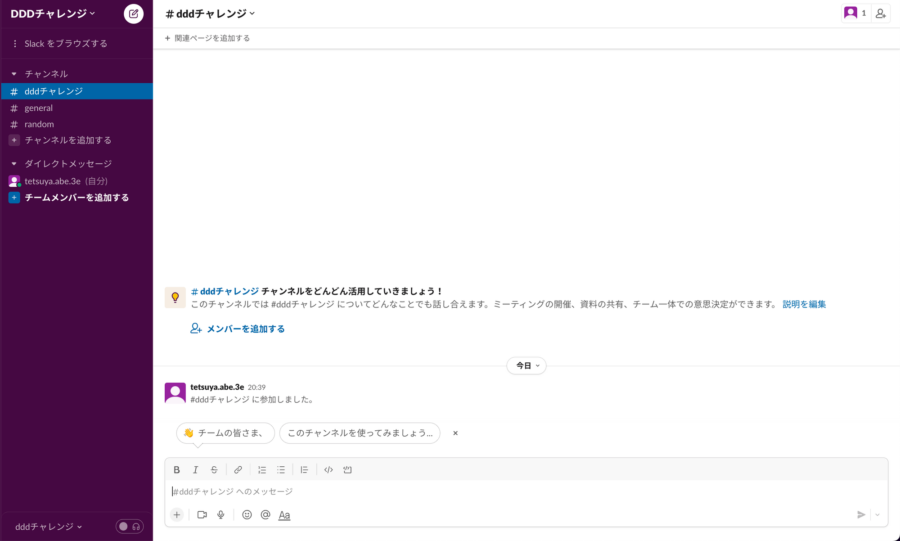
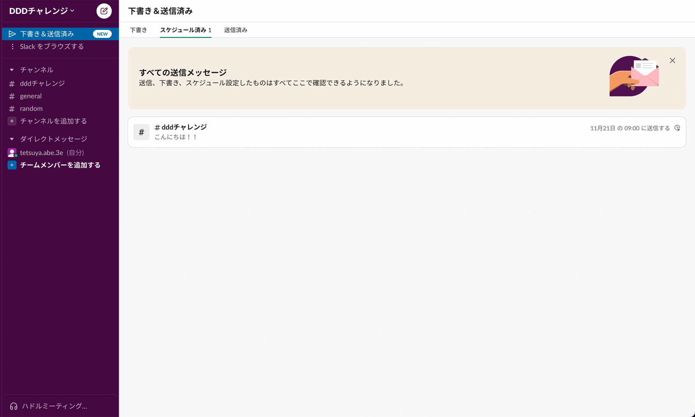
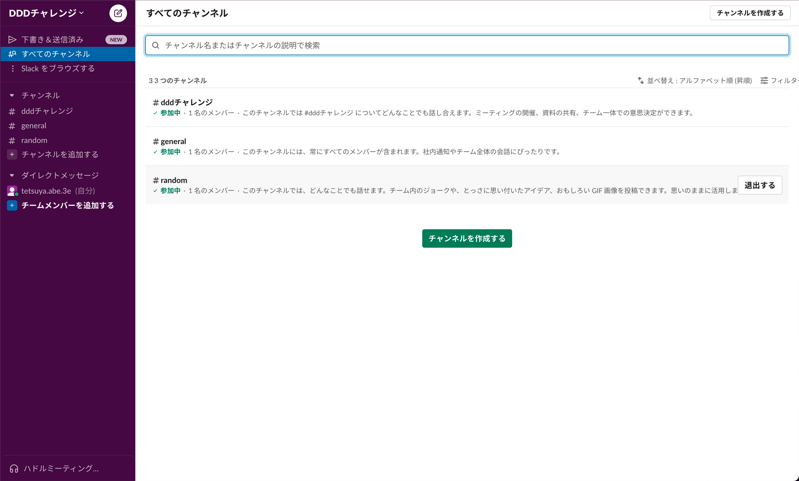

# ddd_challenge

## DOCUMENTS

- [DOCUMENTS](doc/documents.md)

## API LIST

Slack で実際に使われる Usecase を例に挙げて説明します。

# message

- /api/message/get/send

指定したチャンネルの送信済みのメッセージを取得します。  
Slack 上では、メッセージが表示される部分で叩かれます。



コマンド
```shell
curl -H 'channelID:ChannelID_testChannel1_12345' http://localhost:8080/api/message/get/send
```

期待される結果
```json
{
	"messages": [
		{
			"MessageID": "message_122313",
			"MessageBody": " テストメッセージです。",
			"Author": "UserID_testUser1_12345",
			"ChannelID": "ChannelID_testChannel1_12345",
			"IsSend": true,
			"SendAt": "2022-11-20T09:23:44Z",
			"CreatedAt": "2022-11-20T09:23:44Z",
			"UpdatedAt": "2022-11-20T09:23:44Z"
		},
		{
			"MessageID": "message_123123",
			"MessageBody": "こんにちは！ 私は testUser1 です。",
			"Author": "UserID_testUser1_12345",
			"ChannelID": "ChannelID_testChannel1_12345",
			"IsSend": true,
			"SendAt": "2022-11-20T09:23:44Z",
			"CreatedAt": "2022-11-20T09:23:44Z",
			"UpdatedAt": "2022-11-20T09:23:44Z"
		}
	]
}
```

- /api/message/get/notsend

送信予定のメッセージを確認します。
Slack 上では、メッセージが表示される部分で叩かれます。


コマンド
```shell
curl -H 'channelID:ChannelID_testChannel1_12345' -H 'userID:UserID_testUser1_12345' http://localhost:8080/api/message/get/notsend
```

期待される結果
```json
{
	"messages": [
		{
			"MessageID": "message_9123",
			"MessageBody": "未送信のテストメッセージです！",
			"Author": "UserID_testUser1_12345",
			"ChannelID": "ChannelID_testChannel1_12345",
			"IsSend": false,
			"SendAt": "2023-02-28T21:23:38Z",
			"CreatedAt": "2022-11-20T21:23:38Z",
			"UpdatedAt": "2022-11-20T21:23:38Z"
		}
	]
}
```

# channel 

- /api/channel/create

チャンネルを新規作成します。
Slack では、「チャンネルを作成する」ボタンを押すと叩かれます。


コマンド
```shell
curl -H 'channelName:general' http://localhost:8080/api/channel/create
```

期待される結果
```json
{
	"Success": true
}
```

# user

- /api/user/get

コマンド
```shell
curl -H 'userID:UserID_testUser1_12345' http://localhost:8080/api/user/get
```

期待される結果
```json
{
	"User": {
		"UserID": "UserID_testUser1_12345",
		"UserName": "testUser1",
		"Password": "password",
		"CreatedAt": "2022-11-20T21:23:37Z",
		"UpdatedAt": "2022-11-20T21:23:37Z"
	}
}
```

# user と channel の中間テーブル

- /api/join/delete

コマンド
```shell
curl -H 'channelID:ChannelID_testChannel1_12345' -H 'userID:UserID_testUser1_12345' http://localhost:8080/api/join/delete
```

期待される結果
```json
{
	"Success": true
}
```

- /api/join/create

コマンド
```shell
curl -H 'channelID:ChannelID_testChannel1_12345' -H 'userID:UserID_testUser1_12345' http://localhost:8080/api/join/create
```

期待される結果
```json
{
	"Success": true
}
```

- /api/join/get/user

コマンド
```shell
curl -H 'channelID:ChannelID_testChannel1_12345' http://localhost:8080/api/join/get/user
```

期待される結果
```json
{
	"join": [
		{
			"UserID": "UserID_testUser1_12345",
			"UserName": "testUser1",
			"ChannelID": "ChannelID_testChannel1_12345",
			"ChannelName": "testChannel1",
			"CreatedAt": "2022-11-20T21:27:33Z",
			"UpdatedAt": "2022-11-20T21:27:33Z"
		},
		{
			"UserID": "UserID_testUser2_24567",
			"UserName": "testUser2",
			"ChannelID": "ChannelID_testChannel1_12345",
			"ChannelName": "testChannel1",
			"CreatedAt": "2022-11-20T21:23:38Z",
			"UpdatedAt": "2022-11-20T21:23:38Z"
		}
	]
}
```

- /api/join/get/channel

コマンド
```shell
curl -H 'userID:UserID_testUser1_12345' http://localhost:8080/api/join/get/channel
```

期待される結果
```json
{
  "join": [
    {
      "UserID": "UserID_testUser1_12345",
      "UserName": "testUser1",
      "ChannelID": "ChannelID_testChannel1_12345",
      "ChannelName": "testChannel1",
      "CreatedAt": "2022-11-20T21:27:33Z",
      "UpdatedAt": "2022-11-20T21:27:33Z"
    },
    {
      "UserID": "UserID_testUser1_12345",
      "UserName": "testUser1",
      "ChannelID": "ChannelID_testChannel2_12645",
      "ChannelName": "testChannel2",
      "CreatedAt": "2022-11-20T21:23:37Z",
      "UpdatedAt": "2022-11-20T21:23:37Z"
    }
  ]
}
```